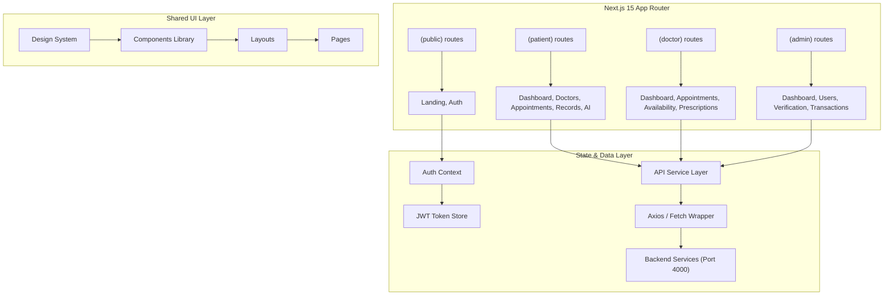
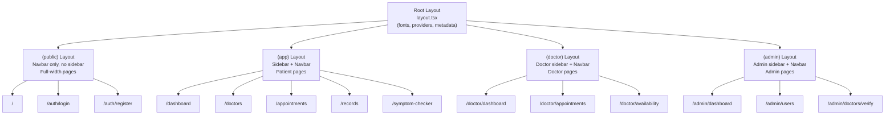
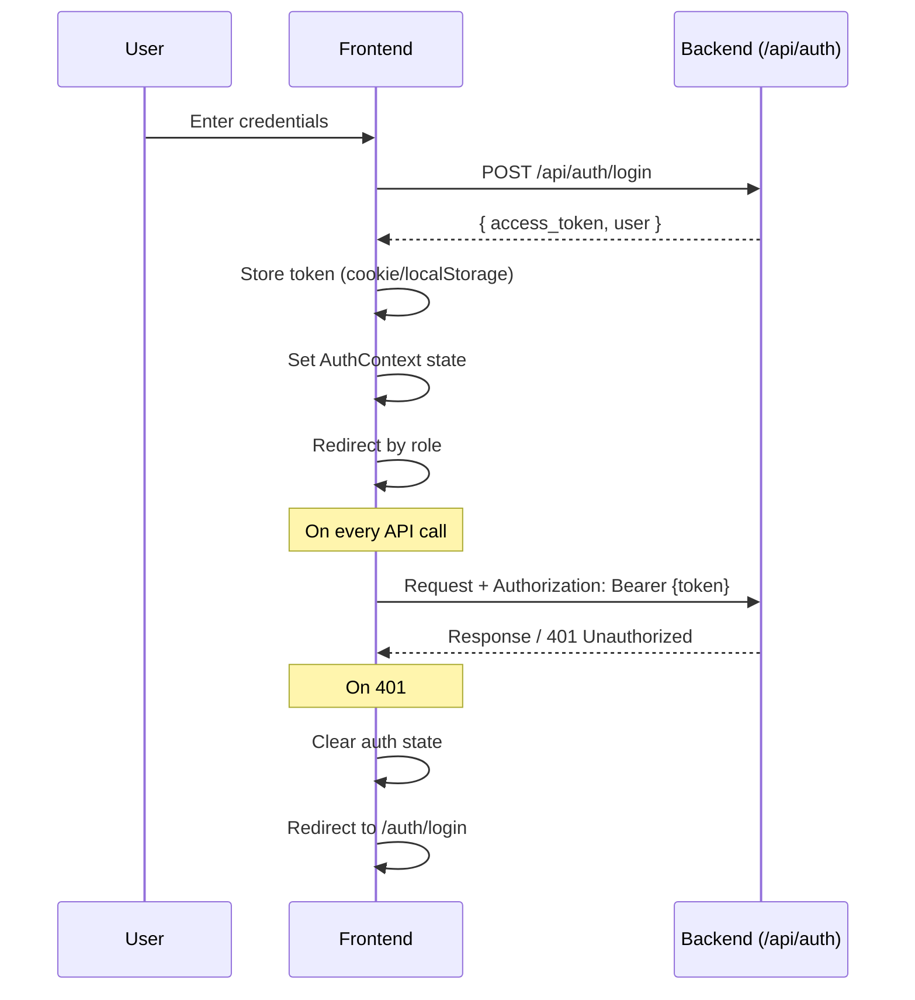

# Healio – UI Architecture Plan

> Technical blueprint for the Healio frontend application built with Next.js 15, React 19, and TailwindCSS 3.

---

## 1. Architecture Overview



---

## 2. Directory Structure

```
apps/web/src/
├── app/                                # Next.js App Router
│   ├── (public)/                       # Public layout group (no sidebar)
│   │   ├── layout.tsx                  # Public layout (navbar only)
│   │   ├── page.tsx                    # Landing page
│   │   └── auth/
│   │       ├── login/
│   │       │   └── page.tsx
│   │       ├── register/
│   │       │   ├── page.tsx            # Patient registration
│   │       │   └── doctor/
│   │       │       └── page.tsx        # Doctor registration
│   │       └── forgot-password/
│   │           └── page.tsx
│   │
│   ├── (app)/                          # Authenticated layout group (sidebar + navbar)
│   │   ├── layout.tsx                  # App layout with sidebar
│   │   ├── dashboard/
│   │   │   └── page.tsx                # Patient dashboard
│   │   ├── doctors/
│   │   │   ├── page.tsx                # Doctor search & listing
│   │   │   └── [id]/
│   │   │       └── page.tsx            # Doctor profile
│   │   ├── appointments/
│   │   │   ├── page.tsx                # My appointments
│   │   │   ├── [id]/
│   │   │   │   └── page.tsx            # Appointment detail
│   │   │   └── book/
│   │   │       └── [doctorId]/
│   │   │           └── page.tsx        # Booking flow
│   │   ├── consultations/
│   │   │   └── [id]/
│   │   │       └── page.tsx            # Video consultation room
│   │   ├── records/
│   │   │   └── page.tsx                # Medical records
│   │   ├── prescriptions/
│   │   │   └── page.tsx                # My prescriptions
│   │   ├── symptom-checker/
│   │   │   └── page.tsx                # AI symptom checker
│   │   ├── payments/
│   │   │   └── checkout/
│   │   │       └── [appointmentId]/
│   │   │           └── page.tsx        # Payment checkout
│   │   ├── notifications/
│   │   │   └── page.tsx                # Notification center
│   │   └── settings/
│   │       └── page.tsx                # Profile & settings
│   │
│   ├── (doctor)/                       # Doctor layout group
│   │   ├── layout.tsx                  # Doctor sidebar layout
│   │   └── doctor/
│   │       ├── dashboard/
│   │       │   └── page.tsx
│   │       ├── appointments/
│   │       │   └── page.tsx
│   │       ├── availability/
│   │       │   └── page.tsx
│   │       └── prescriptions/
│   │           └── issue/
│   │               └── [appointmentId]/
│   │                   └── page.tsx
│   │
│   ├── (admin)/                        # Admin layout group
│   │   ├── layout.tsx                  # Admin sidebar layout
│   │   └── admin/
│   │       ├── dashboard/
│   │       │   └── page.tsx
│   │       ├── users/
│   │       │   └── page.tsx
│   │       ├── doctors/
│   │       │   └── verify/
│   │       │       └── page.tsx
│   │       └── transactions/
│   │           └── page.tsx
│   │
│   ├── layout.tsx                      # Root layout
│   ├── globals.css                     # Global styles
│   ├── loading.tsx                     # Global loading UI
│   └── not-found.tsx                   # 404 page
│
├── components/                         # Shared components
│   ├── ui/                             # Design system primitives
│   │   ├── button.tsx
│   │   ├── input.tsx
│   │   ├── card.tsx
│   │   ├── badge.tsx
│   │   ├── modal.tsx
│   │   ├── table.tsx
│   │   ├── tabs.tsx
│   │   ├── avatar.tsx
│   │   ├── dropdown.tsx
│   │   ├── toast.tsx
│   │   ├── skeleton.tsx
│   │   ├── stepper.tsx
│   │   ├── calendar.tsx
│   │   ├── file-upload.tsx
│   │   ├── search-bar.tsx
│   │   ├── stat-card.tsx
│   │   ├── chart.tsx
│   │   └── empty-state.tsx
│   │
│   ├── layout/                         # Layout components
│   │   ├── navbar.tsx                  # Top navigation bar
│   │   ├── sidebar.tsx                 # Side navigation
│   │   ├── footer.tsx                  # Footer
│   │   └── page-header.tsx             # Page title + breadcrumbs
│   │
│   ├── auth/                           # Auth-specific components
│   │   ├── login-form.tsx
│   │   ├── register-form.tsx
│   │   ├── doctor-register-form.tsx
│   │   └── auth-guard.tsx              # Route protection HOC
│   │
│   ├── doctors/                        # Doctor-related components
│   │   ├── doctor-card.tsx
│   │   ├── doctor-filter.tsx
│   │   ├── doctor-profile-header.tsx
│   │   └── availability-calendar.tsx
│   │
│   ├── appointments/                   # Appointment components
│   │   ├── appointment-card.tsx
│   │   ├── appointment-list.tsx
│   │   ├── booking-stepper.tsx
│   │   ├── time-slot-picker.tsx
│   │   └── status-badge.tsx
│   │
│   ├── consultation/                   # Video consultation
│   │   ├── video-room.tsx              # Jitsi Meet wrapper
│   │   ├── consultation-sidebar.tsx
│   │   └── consultation-controls.tsx
│   │
│   ├── records/                        # Medical records
│   │   ├── record-card.tsx
│   │   ├── upload-zone.tsx
│   │   └── record-viewer.tsx
│   │
│   ├── prescriptions/                  # Prescription components
│   │   ├── prescription-card.tsx
│   │   ├── prescription-form.tsx
│   │   └── prescription-preview.tsx
│   │
│   ├── dashboard/                      # Dashboard widgets
│   │   ├── welcome-banner.tsx
│   │   ├── quick-actions.tsx
│   │   ├── upcoming-appointments.tsx
│   │   └── recent-activity.tsx
│   │
│   └── notifications/                  # Notification components
│       ├── notification-item.tsx
│       ├── notification-list.tsx
│       └── notification-bell.tsx
│
├── lib/                                # Utilities & configuration
│   ├── api/                            # API service layer
│   │   ├── client.ts                   # Axios/fetch instance with interceptors
│   │   ├── auth.ts                     # Auth API calls
│   │   ├── appointments.ts             # Appointments API calls
│   │   ├── doctors.ts                  # Doctors API calls
│   │   ├── payments.ts                 # Payments API calls
│   │   ├── records.ts                  # Medical records API calls
│   │   ├── prescriptions.ts            # Prescriptions API calls
│   │   ├── notifications.ts            # Notifications API calls
│   │   ├── sessions.ts                 # Telemedicine sessions API calls
│   │   └── ai.ts                       # AI symptom checker API calls
│   │
│   ├── hooks/                          # Custom React hooks
│   │   ├── use-auth.ts                 # Auth state hook
│   │   ├── use-appointments.ts         # Appointments data hook
│   │   ├── use-doctors.ts              # Doctors data hook
│   │   ├── use-notifications.ts        # Notifications hook (with real-time)
│   │   ├── use-debounce.ts             # Debounced value hook
│   │   └── use-media-query.ts          # Responsive breakpoint hook
│   │
│   ├── context/                        # React contexts
│   │   ├── auth-context.tsx            # Authentication state provider
│   │   ├── theme-context.tsx           # Theme (light/dark) provider
│   │   └── notification-context.tsx    # Notification state provider
│   │
│   ├── utils/                          # Utility functions
│   │   ├── cn.ts                       # className merger (clsx + tailwind-merge)
│   │   ├── format-date.ts              # Date formatting helpers
│   │   ├── format-currency.ts          # Currency formatting
│   │   ├── validators.ts               # Form validation schemas
│   │   └── constants.ts                # App constants (roles, statuses, etc.)
│   │
│   └── types/                          # TypeScript type definitions
│       ├── user.ts                     # User, Doctor, Patient, Admin types
│       ├── appointment.ts              # Appointment types
│       ├── prescription.ts             # Prescription types
│       ├── payment.ts                  # Payment types
│       ├── notification.ts             # Notification types
│       ├── medical-record.ts           # Medical record types
│       └── api.ts                      # API response types
│
└── assets/                             # Static assets
    ├── images/                         # Illustrations, backgrounds
    └── icons/                          # Custom SVG icons (if any)
```

---

## 3. Route Groups & Layouts

Next.js 15 App Router uses **route groups** `(folder)` to organize layouts without affecting URL paths.



### Layout Hierarchy

| Layout | Components | Auth Required | Role Guard |
|---|---|---|---|
| Root | Font loading, `AuthProvider`, `ThemeProvider`, `ToastProvider` | No | – |
| (public) | Public Navbar, Footer | No | – |
| (app) | App Navbar, Patient Sidebar | Yes | `patient` |
| (doctor) | App Navbar, Doctor Sidebar | Yes | `doctor` |
| (admin) | App Navbar, Admin Sidebar | Yes | `admin` |

---

## 4. Design System

### 4.1 Color Palette

| Token | Light Mode | Usage |
|---|---|---|
| `primary-50` to `primary-950` | Sky blue scale (#f0f9ff → #082f49) | Primary actions, links, branding |
| `medical-50` to `medical-900` | Teal scale (#f0fdfa → #134e4a) | Medical/health accents |
| `success` | `#10b981` (emerald-500) | Confirmed, completed, success states |
| `warning` | `#f59e0b` (amber-500) | Pending, attention needed |
| `danger` | `#ef4444` (red-500) | Errors, cancellations, delete actions |
| `info` | `#3b82f6` (blue-500) | Information, in-progress |
| `neutral` | gray-50 to gray-900 | Text, backgrounds, borders |

### 4.2 Typography

| Style | Font | Size | Weight | Usage |
|---|---|---|---|---|
| H1 | Geist Sans | 36px / 2.25rem | 700 Bold | Page titles |
| H2 | Geist Sans | 30px / 1.875rem | 600 Semibold | Section titles |
| H3 | Geist Sans | 24px / 1.5rem | 600 Semibold | Card titles |
| H4 | Geist Sans | 20px / 1.25rem | 500 Medium | Subsection titles |
| Body | Geist Sans | 16px / 1rem | 400 Regular | Default body text |
| Body SM | Geist Sans | 14px / 0.875rem | 400 Regular | Secondary text, captions |
| Label | Geist Sans | 14px / 0.875rem | 500 Medium | Form labels, badges |
| Mono | Geist Mono | 14px / 0.875rem | 400 Regular | Code, transaction IDs |

### 4.3 Spacing Scale

TailwindCSS default spacing scale (0.25rem base):
- `p-4` (1rem / 16px) — Default component padding
- `gap-4` to `gap-6` — Grid/flex gaps
- `space-y-6` — Section spacing

### 4.4 Border Radius

| Token | Value | Usage |
|---|---|---|
| `rounded-lg` | 8px | Buttons, inputs |
| `rounded-xl` | 12px | Cards |
| `rounded-2xl` | 16px | Feature cards, modals |
| `rounded-full` | 9999px | Avatars, badges, pills |

### 4.5 Shadows

| Token | Usage |
|---|---|
| `shadow-sm` | Subtle card elevation |
| `shadow-md` | Hovered cards, dropdowns |
| `shadow-lg` | Modals, floating elements |
| `shadow-xl` | Navbar on scroll |

### 4.6 Animations

| Animation | CSS | Usage |
|---|---|---|
| Fade in | `animate-fadeIn` (opacity 0→1, 300ms) | Page transitions, modals |
| Slide up | `animate-slideUp` (translateY 10→0, 300ms) | Cards, notifications |
| Pulse | `animate-pulse` | Skeleton loaders |
| Spin | `animate-spin` | Loading spinners |
| Bounce | `animate-bounce` | Notification badge |
| Scale | Hover `scale-[1.02]` | Card hover effects |
| Shake | `animate-shake` | Form validation errors |

---

## 5. State Management Architecture

### 5.1 Auth Flow



### 5.2 Client-Side Data Fetching Strategy

| Approach | When to Use | Example |
|---|---|---|
| **Server Components** (default) | Static/semi-static data, SEO-critical pages | Landing page, Doctor profile |
| **Client Components** (`'use client'`) | Interactive UI, real-time data, user actions | Dashboard, forms, video room |
| **SWR / React Query** | Cached client-side fetching with revalidation | Appointment lists, notifications |
| **React Context** | Global state shared across components | Auth state, theme, notifications |

### 5.3 Context Providers

```tsx
// Root Layout Provider Stack
<AuthProvider>          {/* JWT token, user data, login/logout */}
  <ThemeProvider>       {/* Light/dark mode */}
    <NotificationProvider> {/* Notification count, real-time updates */}
      <ToastProvider>   {/* Global toast notifications */}
        {children}
      </ToastProvider>
    </NotificationProvider>
  </ThemeProvider>
</AuthProvider>
```

---

## 6. API Service Layer

### 6.1 HTTP Client Configuration

```typescript
// lib/api/client.ts — Centralized API client
const apiClient = axios.create({
  baseURL: process.env.NEXT_PUBLIC_API_URL || 'http://localhost:4000/api',
  timeout: 10000,
  headers: { 'Content-Type': 'application/json' },
});

// Request interceptor: attach JWT token
apiClient.interceptors.request.use((config) => {
  const token = getToken();
  if (token) config.headers.Authorization = `Bearer ${token}`;
  return config;
});

// Response interceptor: handle 401 → redirect to login
apiClient.interceptors.response.use(
  (response) => response,
  (error) => {
    if (error.response?.status === 401) {
      clearAuth();
      window.location.href = '/auth/login';
    }
    return Promise.reject(error);
  }
);
```

### 6.2 Service Modules

Each API module exports typed functions:

```typescript
// lib/api/appointments.ts
export const appointmentsApi = {
  searchDoctors: (params: SearchParams) => apiClient.get('/appointments/doctors/search', { params }),
  getDoctorSlots: (doctorId: string) => apiClient.get(`/appointments/doctors/${doctorId}/slots`),
  book: (data: BookingData) => apiClient.post('/appointments', data),
  getMyAppointments: () => apiClient.get('/appointments/my'),
  modify: (id: string, data: Partial<Appointment>) => apiClient.patch(`/appointments/${id}`, data),
  accept: (id: string, status: 'confirmed' | 'rejected') => apiClient.patch(`/appointments/${id}/accept`, { status }),
};
```

---

## 7. Authentication & Authorization

### 7.1 Auth Guard Component

```tsx
// components/auth/auth-guard.tsx
'use client';

export function AuthGuard({ children, allowedRoles }: {
  children: React.ReactNode;
  allowedRoles: ('patient' | 'doctor' | 'admin')[];
}) {
  const { user, isLoading } = useAuth();
  const router = useRouter();

  useEffect(() => {
    if (!isLoading && !user) router.push('/auth/login');
    if (!isLoading && user && !allowedRoles.includes(user.role)) {
      router.push('/unauthorized');
    }
  }, [user, isLoading]);

  if (isLoading) return <PageSkeleton />;
  if (!user || !allowedRoles.includes(user.role)) return null;
  return <>{children}</>;
}
```

### 7.2 Layout-Level Protection

Each route group layout wraps children with `AuthGuard`:

```tsx
// app/(app)/layout.tsx — Patient layout
export default function AppLayout({ children }) {
  return (
    <AuthGuard allowedRoles={['patient']}>
      <div className="flex h-screen">
        <Sidebar role="patient" />
        <main className="flex-1 overflow-auto">
          <Navbar />
          <div className="p-6">{children}</div>
        </main>
      </div>
    </AuthGuard>
  );
}
```

---

## 8. Component Design Patterns

### 8.1 Component Structure

Every component follows this structure:

```
components/ui/button.tsx
├── Props interface (ButtonProps)
├── Component function
├── Variant styles (using cva or switch/map)
├── Forward ref (for form components)
└── Export
```

### 8.2 Variant Pattern (Example: Button)

```tsx
interface ButtonProps extends React.ButtonHTMLAttributes<HTMLButtonElement> {
  variant?: 'primary' | 'secondary' | 'danger' | 'ghost' | 'outline';
  size?: 'sm' | 'md' | 'lg';
  isLoading?: boolean;
  leftIcon?: React.ReactNode;
  rightIcon?: React.ReactNode;
}
```

### 8.3 Composition Pattern (Example: Card)

```tsx
// Usage:
<Card>
  <Card.Header>
    <Card.Title>Upcoming Appointment</Card.Title>
    <Card.Action><Badge>Confirmed</Badge></Card.Action>
  </Card.Header>
  <Card.Body>...</Card.Body>
  <Card.Footer>
    <Button>Join Call</Button>
  </Card.Footer>
</Card>
```

---

## 9. Responsive Breakpoints

| Breakpoint | Width | Target |
|---|---|---|
| `sm` | ≥ 640px | Large phones (landscape) |
| `md` | ≥ 768px | Tablets |
| `lg` | ≥ 1024px | Small laptops |
| `xl` | ≥ 1280px | Desktops |
| `2xl` | ≥ 1536px | Large screens |

### Responsive Behaviors

| Element | Mobile | Tablet | Desktop |
|---|---|---|---|
| Sidebar | Hidden (hamburger toggle) | Collapsed (icons only) | Expanded (icons + labels) |
| Doctor cards grid | 1 column | 2 columns | 3 columns |
| Dashboard stats | 2×2 grid | 4 in a row | 4 in a row |
| Navbar search | Hidden (icon toggle) | Compact | Full width |
| Data tables | Card view (stacked) | Scrollable table | Full table |

---

## 10. Third-Party Integrations

| Integration | Package | Usage |
|---|---|---|
| **Jitsi Meet** | `@jitsi/react-sdk` or iframe | Video consultations |
| **Stripe** | `@stripe/stripe-js` + `@stripe/react-stripe-js` | Payment checkout |
| **Chart.js** | `chart.js` + `react-chartjs-2` | Dashboard analytics charts |
| **Date Picker** | `react-day-picker` or `date-fns` | Calendar & date selection |
| **Toast** | `react-hot-toast` or custom | Notification toasts |
| **Form Validation** | `react-hook-form` + `zod` | Form handling & validation |
| **Icons** | `lucide-react` (already installed) | UI icons |

---

## 11. Performance Optimization

| Strategy | Implementation |
|---|---|
| **Code Splitting** | Next.js automatic per-route splitting |
| **Lazy Loading** | `dynamic()` for heavy components (Charts, Jitsi, Calendar) |
| **Image Optimization** | `next/image` for all images |
| **Skeleton Loading** | Custom skeleton components for every data-dependent page |
| **Debounced Search** | `useDebounce` hook for search inputs (300ms delay) |
| **Memoization** | `React.memo` for expensive list items (DoctorCard, AppointmentCard) |
| **Virtual Scrolling** | For long lists (notification history, transaction logs) |

---

## 12. Build Order (Implementation Phases)

### Phase 1: Foundation & Landing Page (Day 1–2)
- [ ] Set up directory structure (all folders)
- [ ] Create design system components (`button`, `input`, `card`, `badge`, `modal`, `avatar`)
- [ ] Create layout components (`navbar`, `sidebar`, `footer`, `page-header`)
- [ ] Set up `AuthContext`, `api/client.ts`, `cn.ts`
- [ ] Create root layout with providers
- [ ] Create route group layouts: `(public)`, `(app)`, `(doctor)`, `(admin)`
- [ ] **Redesign Landing Page** — Full rebuild with: Hero + animated CTA, Trust Bar (stats counters), Features Grid, How It Works (4-step flow), Specialties Grid, Testimonials, CTA Banner, Footer. The current landing page is a basic skeleton and needs a premium, production-quality redesign.

### Phase 2: Auth Pages (Day 3)
- [ ] Login page
- [ ] Patient registration page
- [ ] Doctor registration page (multi-step)
- [ ] Forgot password page
- [ ] Auth guard implementation & testing

### Phase 3: Patient Core (Day 4–5)
- [ ] Patient dashboard
- [ ] Doctor search & listing page
- [ ] Doctor profile page
- [ ] Appointment booking flow (multi-step)
- [ ] My appointments page
- [ ] Appointment detail page

### Phase 4: Patient Extended (Day 6–7)
- [ ] Medical records page (with upload)
- [ ] Prescriptions page
- [ ] AI symptom checker
- [ ] Notification center
- [ ] Payment checkout page
- [ ] Settings page

### Phase 5: Doctor Pages (Day 8–9)
- [ ] Doctor dashboard
- [ ] Doctor appointment management
- [ ] Availability schedule manager
- [ ] Issue prescription form

### Phase 6: Admin Pages (Day 10)
- [ ] Admin dashboard
- [ ] User management
- [ ] Doctor verification
- [ ] Transaction overview

### Phase 7: Video & Polish (Day 11–12)
- [ ] Video consultation room (Jitsi integration)
- [ ] Responsive testing & fixes
- [ ] Animation & micro-interaction polish
- [ ] Dark mode support
- [ ] Final cross-browser testing

---

## 13. Key Dependencies to Install

```bash
# Core (already installed)
# next, react, react-dom, lucide-react, clsx, tailwind-merge

# To be installed
bun add react-hook-form zod @hookform/resolvers     # Form handling
bun add axios                                        # HTTP client
bun add react-hot-toast                              # Toast notifications
bun add react-day-picker date-fns                    # Calendar & dates
bun add chart.js react-chartjs-2                     # Charts
bun add @stripe/stripe-js @stripe/react-stripe-js    # Payments
bun add framer-motion                                # Animations
bun add @jitsi/react-sdk                             # Video calls (or iframe)
```
